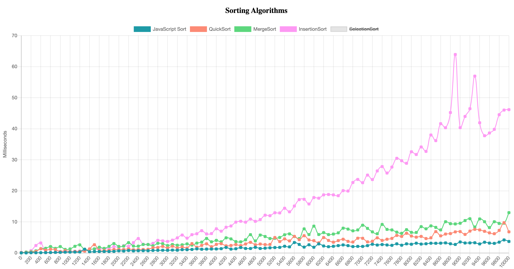
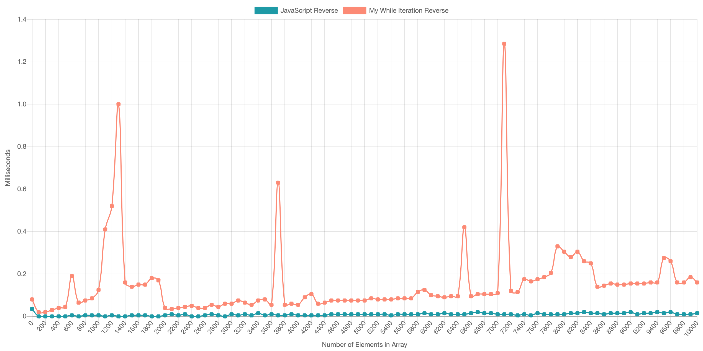

<center><h1> Algorithmic Time Complexity </h1></center>

This is a repo that looks at the algorithmic time complexity of different functions. In the jasmine-3.5.0/src you will find my functions which are compared against the standard JavaScript built in methods.

#

<center><h2> How to Run </h2></center>

#

1. download or clone this repo.
2. Enter whats below into your terminal

```bash
$ cd where_file_was_downloaded/jasmine-3.5.0/
$ open index.html
```

3. You should now be able to see charts with clickable legends

#

<center><h2> The Algorithms </h2></center>

All of the algorithm classes have a timing class instance as part of their constructor. They are then instantiated in make chart (the chart.js file). The make chart is called in generateChart.js where the generate method is called on each chart instance to relate it to its respective canvas.

#

### Shuffle

There is no built in shuffle method for javascript so the Fisher-Yates shuffle is used as a comparison.

### Sorting

The Fisher-Yates shuffle is used for shuffling an ordered array. The functions that are being timed are:
Selection, Merge, Quick and Inserstion Sort.

### Fibonnaci

The for loop requires more reading of array elements whereas the while just uses variable assignment and reassignment

### Reverse

My reverse method pops element from end of old array and inserts it to end of new array. It is timed along with the javascript built in reverse method.

#

## Examples of some of the Charts:

NB: My computer isn't very good so the graphs will likely have more spikes

| <h2>Sort</h2>                                | <h2>Reverse</h2>                             | <h2>Shuffle</h2>                             |
| -------------------------------------------- | -------------------------------------------- | -------------------------------------------- |
|  |  |  |
